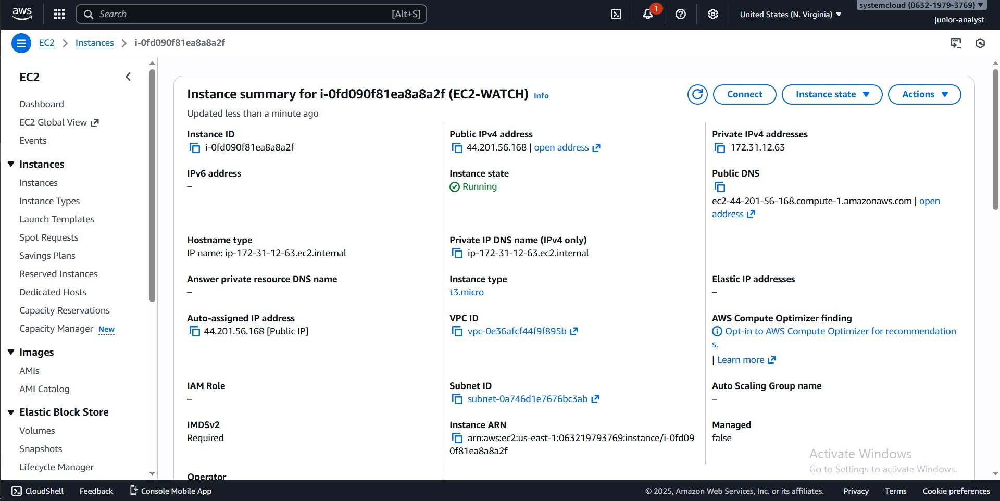

# AWS-PROJECT-Configuring-Amazon-Linux-2-Ec2-Instance-to-Send-Logs-to-Cloud-Watch

## **PROJECT OVERVIEW**
In this project, I created and  configured an Amazon Linux 2 EC2 instance to securely send system and security logs to Amazon CloudWatch.i ran into some errors but I was able to troubleshoot and find the reasons for the errors and solve them.

# The practical skills demonstrated in this project:
-	Cloud monitoring
-	Linux system logging
-	CloudWatch Agent installation and configuration
-	Troubleshooting
-	Security observability
-	AWS IAM and EC2 operations

# Services and Tools Used
-	Amazon EC2 (Amazon Linux 2)
-	Amazon CloudWatch
-	Amazon CloudWatch Agent
-	AWS Identity and Access Management (IAM)

# Architecture Overview
-	An Amazon Linux 2 EC2 instance sends selected system logs to Amazon CloudWatch using the CloudWatch Agent.
-	IAM Role attached to EC2 allows log publishing.
-	CloudWatch automatically creates log groups upon first successful ingestion.
-	Security logs are analyzed using CloudWatch Logs and Metric Filters.

# STEP 1 : EC2 INSTANCE SETUP
-	I launched an Ec2 instance named “EC2WATCH” in us east region in a default VPC
-	I created a security group for the instance with an inbound rule allowing SSH on port 22 from any ipv4 address (just for testing purpose)

